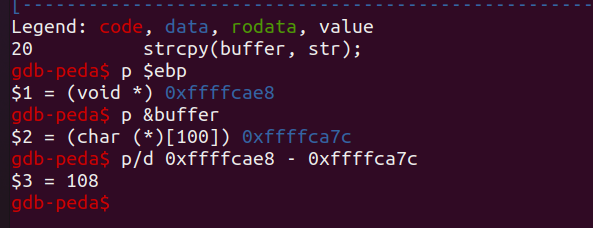
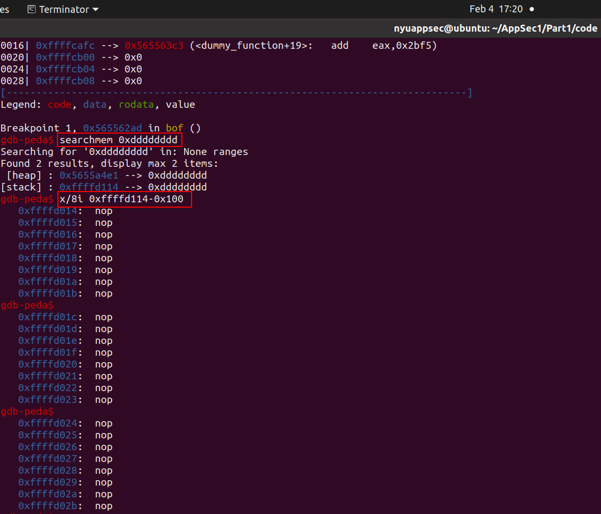
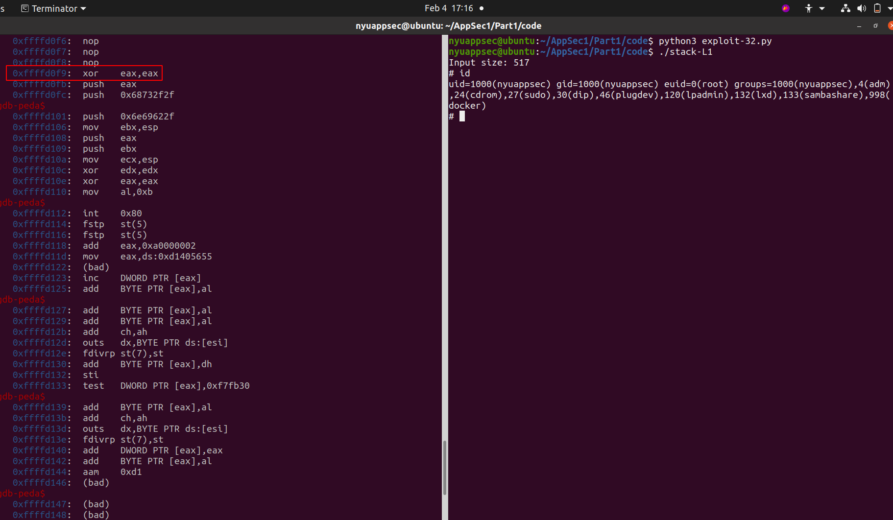
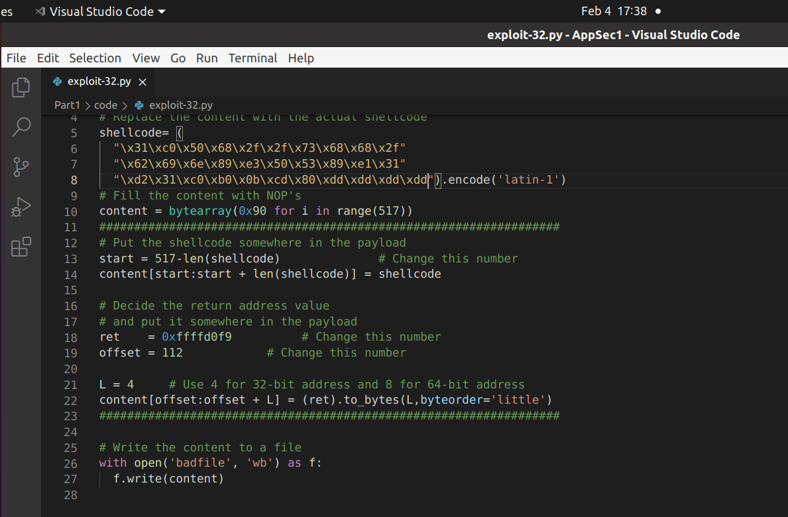
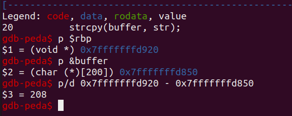
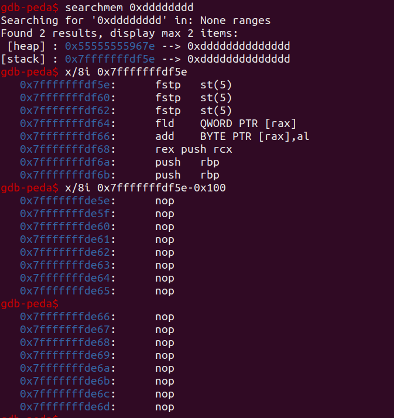
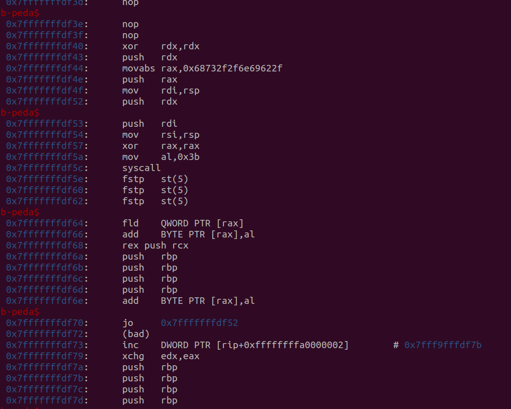
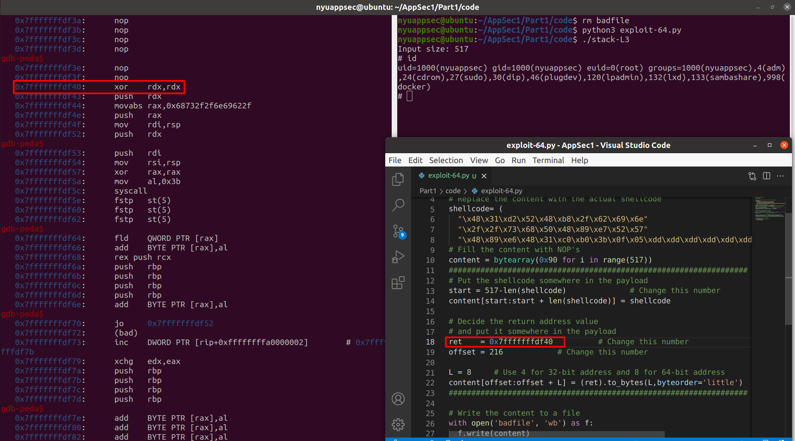
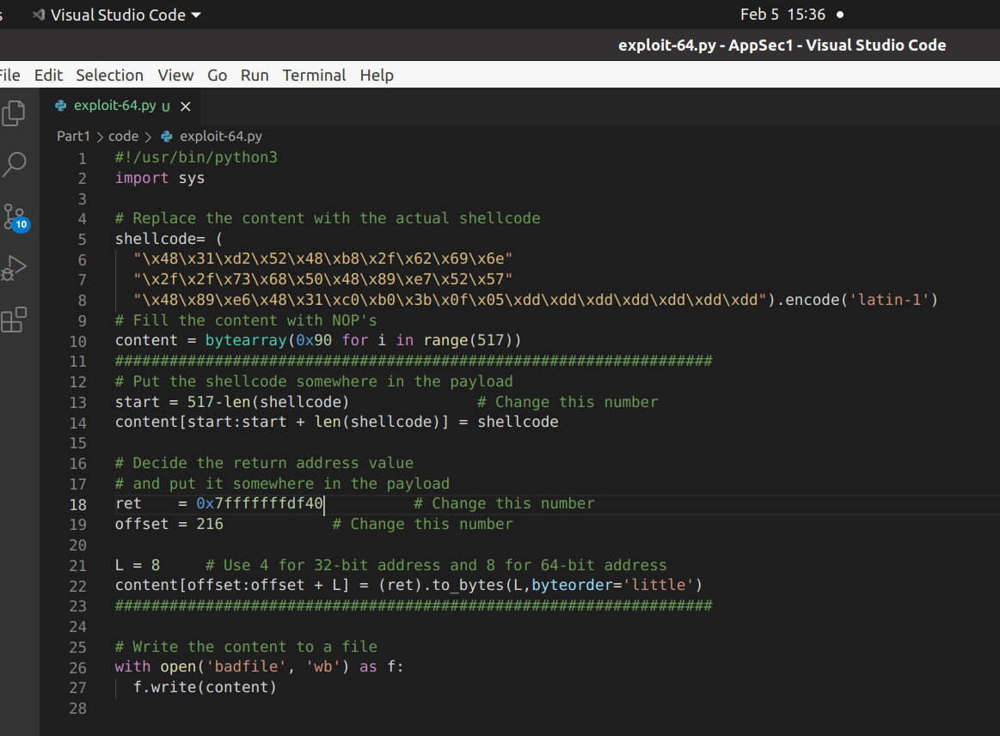
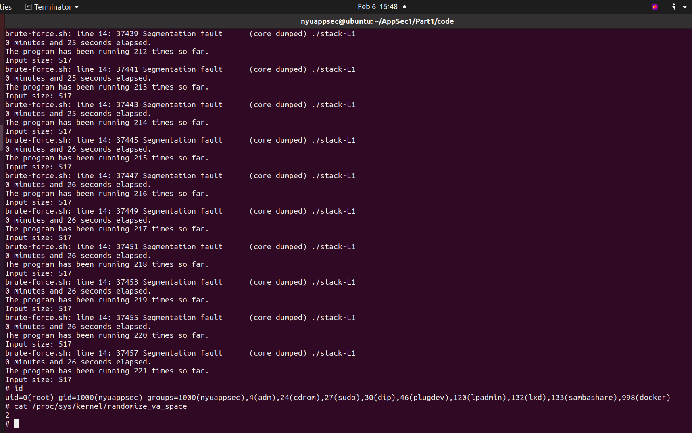

# Task 3: Launching Attack on 32-bit Program (Level 1)

### **1. Finding the value of ebp register and the offset.**
---
> `gdb stack-L1-dgb` 
`b bof` 
`run` 
`next` 

From the above image we find the memory address of the ebp register. Therefore the return address will be at 0xffffcae8 + 4. We also see that the ebp register is 108 places away from the starting address of the buffer. Therefore the distance of the start of buffer and the return address will be 108+4 = 112. This is how we find the inital value for our return address and the offset of 112.

### **2. Finding the value of start variable in the exploit.**
---
517 is the length of input that our program can take. The start variable can be set to the value of 517 - len(shellcode). We place the shellcode at the end of the bytearray so that we it does not overwrite our return address and our return address can easily point to anywhere in the NOP sled to lead right to our shellcode.

### **3. Running with inital values and finding the correct return address.**
---
We now use the following values:
- start = 517 - len(shellcode)
- ret = 0xffffcae8 + 120 (because the stack is deeper when program runs in degub mode)
- offset = 112

Running with the above values did not give us a shell because the return address is not correct. In order to find the correct address we add "\xdd\xdd\xdd\xdd" at the end of the shellcode. This will help us locate our shellcode easily when we debug.
>`gdb stack-L1` 
`b bof` 
`run` 
`searchmem 0xdddddddd` 
`x/8i <stack address of 0xdddddddd>-0x100` 

Here, we are trying to locate the memory address of our shellcode. `searchmem` will give us the stack address of 0xdddddddd and then we use `x/8i` to examine 8 addresses at a time as instructions and we start from 100 addresses before the address of 0xdddddddd. We then keep entering to run the same instruction until we find the start of our shell code.

Once the NOP Sled ends we know we have found the start of our shell code. We use that address as return address in our exploit to get a shell.

## Final Exploit for x86
---

# Task 5: Launching Attack on 64-bit Program (Level 3)
We follow all the same steps as above. We check the value of <b>`p $rbp`</b> because the ebp register is called rbp for 64 bit architecture.

Also the value of offset here will be <b>`208 + 8 = 216`</b> becuase the addresses are 8 bytes and not 4 like in 32 bit architecture.

## Final Exploit for x64
---

# Task 7: Defeating dash's Countermeasure
## Experiment

- Here we observe that when we run the program without the setuid(0) system call, it gives us a shell but the program does not run as root since the effective uid and setuid are not the same. On the other hand when we include the setuid(0) call in our shell code, the program will run as root.

### Repeating attack on Level 1
---

### Repeating attack on Level 3

# Task 8: Defeating Address Randomization
After turning ALSR on, the program did not give us root shell when run normally without bruteforce.

When running the program to bruteforce ASLR we get a shell as shown below.

# Task 9: Experimenting with Other Countermeasures
### 9.a: Turn on the StackGuard Protection
---
After turning the StackGuard on we see that the program aborts itself because it detects that it is being buffer overflowed.

### 9.b: Turn on the Non-executable Stack Protection
---
After turning the non-executable stack protection on, we observe that our buffer overflow attack fails. This is becuase the program is treating all the contents of the stack as read-only data rather than as code. Hence our payload is also now being considered as read-only data and our attack fails.

