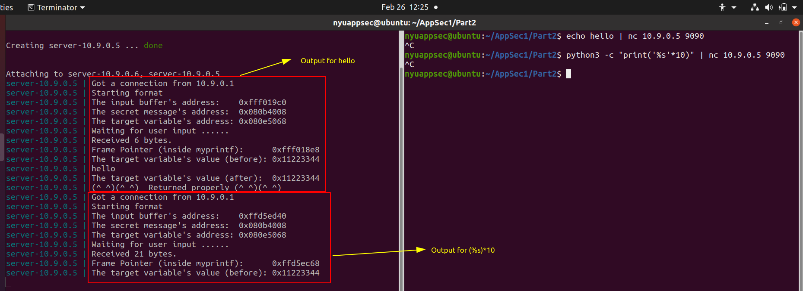
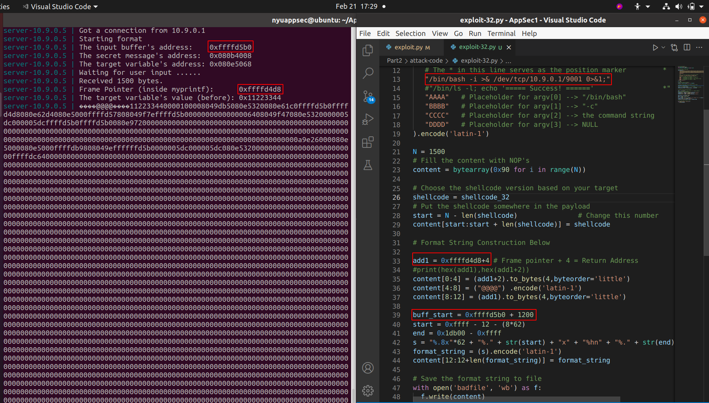
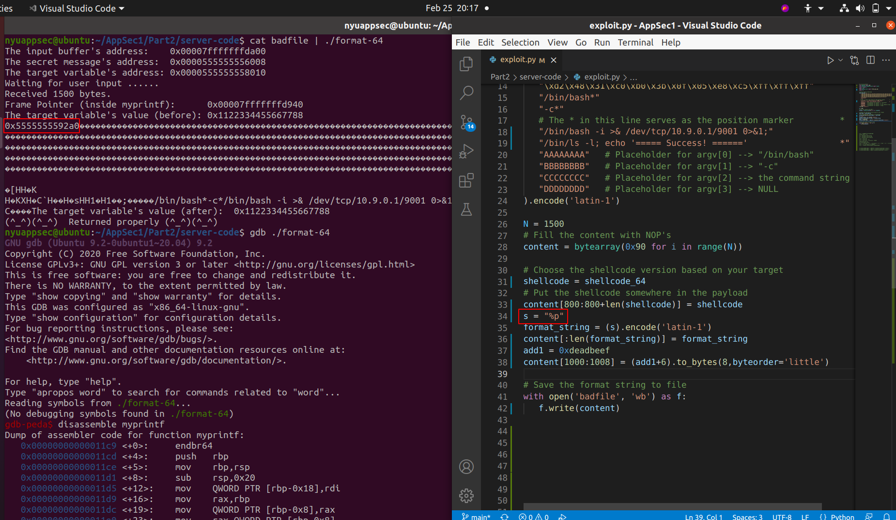
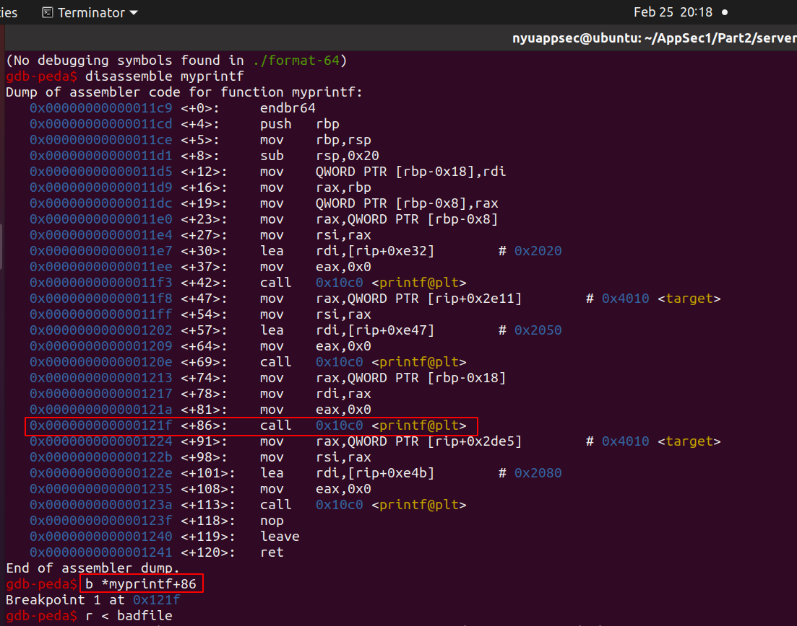
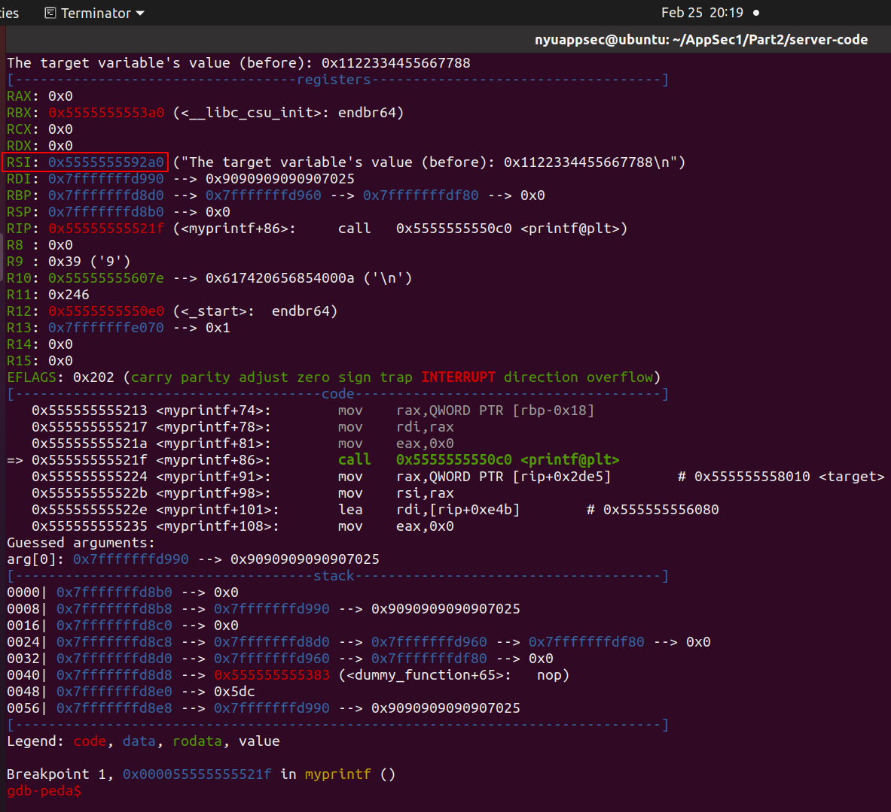
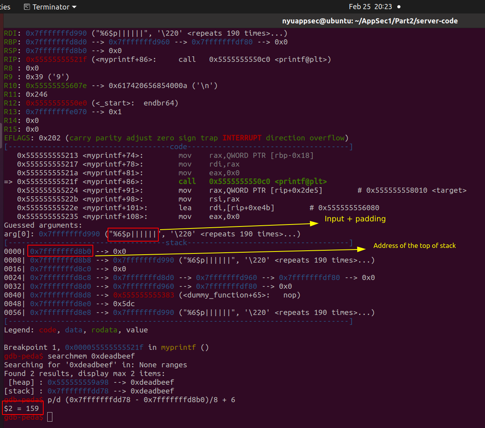
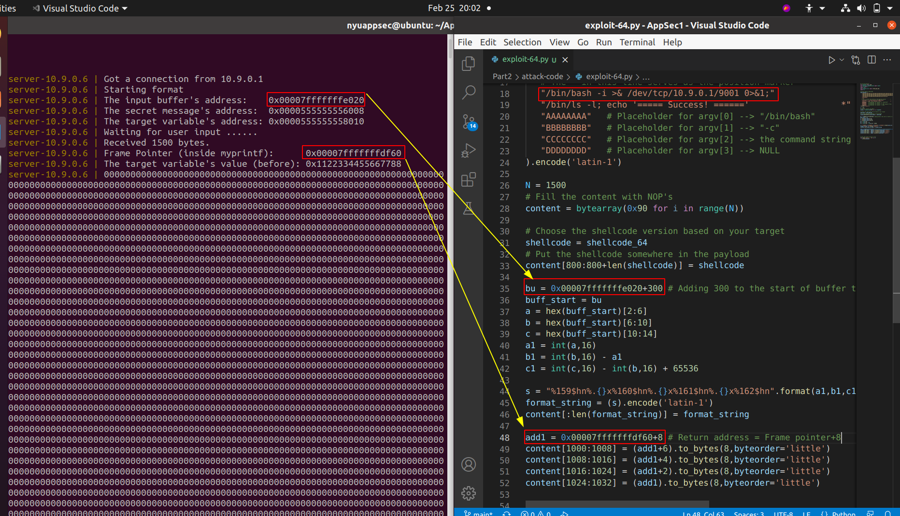
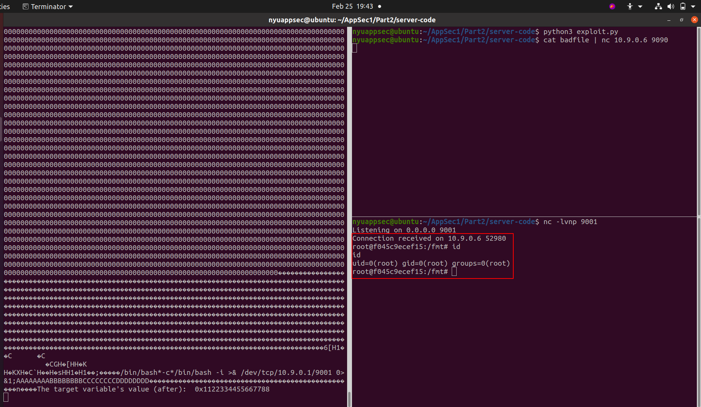
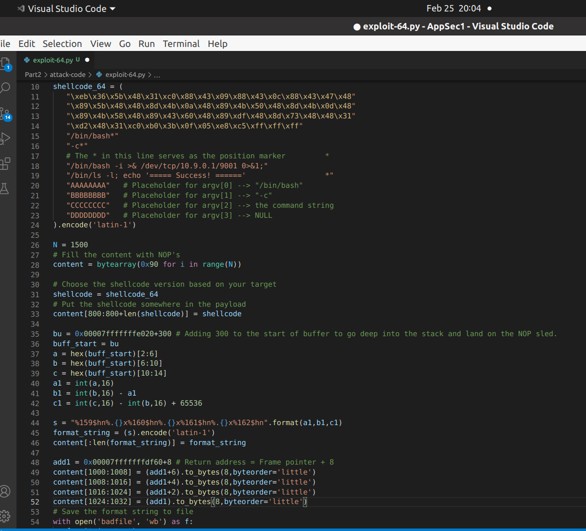
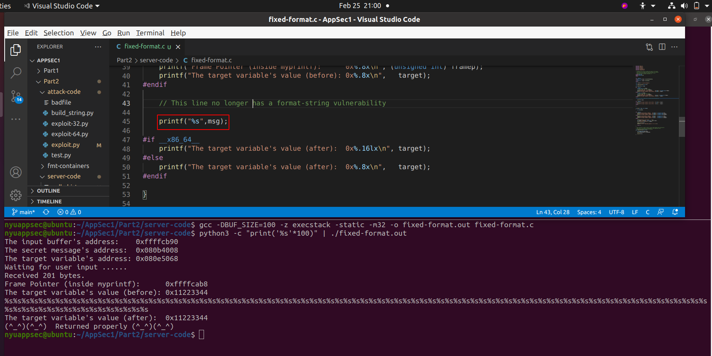

# Task 1: Crashing the Program

In C program, %s is a format specifier used to treat argument as string pointer. When we provide a bunch of %s as input the program will try to print out the data stored at the addresses pointed by the va_list pointer. But here, all the addresses may not be valid hence the program crashes.

# Task 2: Printing Out the Server Program's Memory
### Task 2A: Stack Data
---
In order to print out the data on the stack we use %s format specifier. It is used to treat the argument as an unsigned int. We provide 'AAAA' as an input along with 70 %x.

In the above diagram we can see that `0x41414141` is the value of our input `AAAA` in hex. We can also see that value is printed by the 64th %x. Therefore, we need 64 %x to print out the first four bytes of input.

### Task 2B: Heap Data
---
In order to print out the data stored in the heap we pass the address of the secret message as the first four bytes of our input. We then use 63 %x to reach to our input address and then use %s to print out the data stored at that address as a string.

We can obtain the input address from the server printout and pass it in little endian format.

# Task 3: Modifying the Server Program's Memory
### Task 3A: Change the value to a different value
---
Here, just like the previous task, we pass the address of the target variable in little endian format as the first four bytes of our input. We then use 63 %x to reach to that address and use %n format specifier. %n writes the number of characters printed out so far into the memory.

In this case since we printed out `4 (input address) + 8*63 = 508` characters. Hence, the target variable changed to `1fc` which the 508 in hex.

### Task 3B: Change the value to 0x5000
---
Because of how %n works, in order to change the value of the target to a specific value we need to print out that exact number of characters. Therefore we take the following steps:
- 0x5000 = 20480 in decimal  
- Since we have printed out `4 + 8*62 = 500` characters already we have to print `20480 - 500 = 19980` more.
- For that we use %.19980x.

> <b>Note: Here we use `'%.8x'*62` and not 63 because we print out one more variable when we use `%.19980x` which ultimately brings us to 63 %x. </b>

### Task 3C: Change the value to 0xAABBCCDD
---
If we tried to change the value of target variable to 0xAABBCCDD using the same method we used in the above task we would have to print out 2864434397 characters. Which is not practically possible. So in this case instead of writing 4 bytes at once, we write 2 bytes at a time using %hn format specifier.

The target vaiable's address is 0x080e5068. So the lower two bytes are stored at 0x080e5068 and we change that to 0xCCDD and the higher two bytes are stored at 0x080e506A and we change that to 0xAABB

To caluclate the number of characters to be printed out we do the following:

<b> For the higher two bytes</b>
- 0xAABB = 43707 in decimal
- Chars already printed = 12 (8 input address + 4 pads) + 8*62 = 508
- Chars to be printed = 43199. Hence we use %.43199x

<b> For the lower two bytes </b>
- We need to print 0xCCDD - 0xAABB = 8738 in decimal.
- We use %.8738x for that

> <b>Note: Here we use '@@@@' as padding because after %.43199x we reach the 64th variable which is our first input address, and after %.8738x we reach the 66th variable. Therefore we use padding to seperate our input addresses so that the last input address is at the 66th position. If we did not use padding the last input address would have been at position 65 and our format string would not have been able to overwrite it. </b>

# Task 4: Inject Malicious Code into the Server Program

<b>Question 1</b>

Ans: The address marked at position two is the return address. The return address = Address of frame pointer + 4. Since the program output proivdes the address of frame pointer which is 0xffffd4d8 + 4 = 0xffffd4dc.

The address marked at location 3 is the start address of the input buffer which is also provided in the program output = 0xffffd5b0

<b>Question 2</b>

Ans: As mentioned earlier we need 63 %x format specifiers to move the format string argument pointer to 3.

### Exploit
---
Here, to create the exploit we use all the techniques we learnt while completing the previous tasks.
- We start by placing the shellcode at the very end of our input.
- We store the return address at the beginning of our input and seperate the higher and the lower address with padding of 4 bytes.
- Since the length of our input is 1500 and our shellcode cannot we more than 250 bytes we choose to jump start of input buffer address + 1200 so that we can safely land on the NOP sled and reach our shellcode.

Below image shows where the malicious code is inside the buffer. 0xffffd5b0 + 1200 = 0xFFFFE7B0

- Using the same method in Task 3C we calculate the number of characters to be printed out in order to reach the NOP Sled.
- We place the format string right after our return addresses.
- We also add the reverse shell command to our shellcode so that we can listen on a port and catch the reverse shell from the server.

I have not included multiple screenshots of the entire exploit since it does not fit in one image. You can find the entire exploit [here](../Part2/attack-code/exploit-32.py)

# Task 5: Attacking the 64-bit Server Program
Let us first talk about the problem of dealing with the null byte. One way to solve the issue is to place our return address at the end of the input. We can make sure that our format string and our shellcode does not contain any null bytes. This way, the there will be no necessary code to run after the return address and the we can achieve the desired output.

This is how our input will look like:
> `Format string | NOP | Shellcode | NOP | Return Address`

We use the same exploit we used for the 32 bit but we make the following changes:
- We place the format string at position 0 in our bytearray.
- We place the shellcode starting at position 800.
- We place the return address starting at position 1000.

Now that we have finalized the positions in our input we move towards constructing the exploit step by step.

### Step 1: Finding Offset
---
In order to find the offset we start by using just %p to print the value of the pointer. It will output an address like below.

We will use gdb to find out more about the value that got printed and the start of our stack.

Inside gdb we disassemble the myprintf function to set a break point at the vulnerable printf. We can see in the image above that the address of vulnerable printf is `*myprint+86` hence we set a breakpoint at that address.

We can see below that the value printed out was the value inside RSI register and not the stack. In order to reach to the top of the stack we will have to print out the 6th variable.

We now use `%6$p` as our format string to print out the 6th variable which is the top of the stack. We also using some padding. In the add1 which will be our return address we place an arbitary value of 0xdeadbeef.

We now use `searchmem` command to search for 0xdeadbeef in the memory. We then subtract the address of 0xdeadbeef from the address of the top of the stack and divide it by 8. We divide by 8 becuase the address in 64 bit are 8 bytes long. We add 6 to it because we already moved 6 variables with `%6$p`.

In the image above we can see that starting from the 159th variable will be our return address.

We now try giving `%159$p` as our format string to check if our calculations are correct.

### Step 2: Changing the value of the target address
---
We now try change the value of the target variable to 0xaabbccddeeff.

In 32 bit we divded the 4 byte address in 2 parts and overwrote 2 bytes at a time. Here we divide the 8 byte address into 4 parts. We take the address of the target variable from the program output. Since we know our address the 159th variable, all the addresses after it will be just one variable ahead.

- The higher two byes will be 0x0000 so we simply use `%159$n` to write 0000 to 159 variable.
- The next two bytes will be 0xaabb = 43707 in decimal. So we use `%.43707x%160$hn`
- The next two bytes will be 0xccdd - 0xaabb
- The last two bytes will be 0xeeff - 0xccdd. Since the return will be negative we add 0x10000 to it which is 65536 in decimal.

Now that we have successfully overwritten the target variable we know our exploit works.

### Step 3: Final Exploit
---
We now have to change the add1 variable in our exploit to the return address.
The Return address =  Address of the frame pointer + 8. We have to overwrite the return address with the address of our shellcode. For this take the start address of our buffer and add 300 to it so that we can safely land on the NOP Sled and reach the shellcode.

We also add the reverse shell payload to our shellcode.

You can find the final exploit [here](../Part2/attack-code/exploit-64.py)

# Task 6: Fixing the Problem

We fix the vulnerabillity in the program by changing the printf statement to include '%s'. It will then treat all the input as a string and not execute any commands.

We can see in the above image, after fixing the code the compiler does not give any warning and our attack to crash the program also does not work.